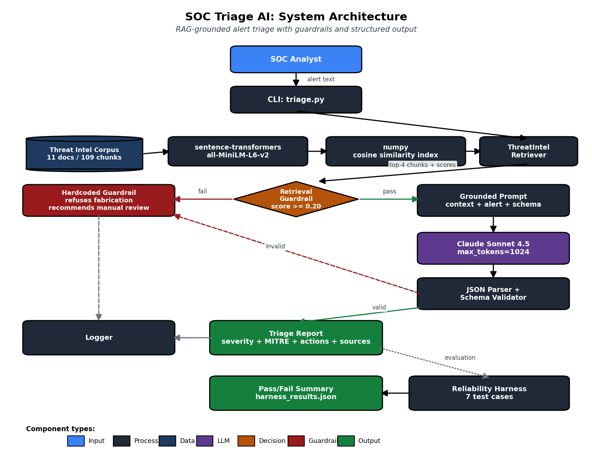

# SOC Triage AI

**RAG-grounded security alert triage with structured JSON output, MITRE ATT&CK mapping, and reliability evaluation.**

A SOC analyst assistant that ingests raw security alerts, retrieves relevant threat intelligence, and produces structured triage reports including severity classification, MITRE technique mapping, recommended actions, and escalation decisions.

## Base Project

This project is conceptually derived from **The Mood Machine** (CodePath AI110 Module 3), which classified text into sentiment categories using prompt-engineered LLM calls. SOC Triage AI applies the same core pattern, LLM-based categorical classification with structured output, to a higher-stakes domain. The implementation is largely new: retrieval-augmented grounding, MITRE ATT&CK mapping, schema validation, and a reliability harness are additions specific to the security domain.

The lesson carried forward: prompt engineering and structured output are general patterns that transfer across domains, but the system architecture around them determines whether the project is portfolio-worthy.

## Architecture



The system processes alerts through five stages:

1. **Embedding-based retrieval**: incoming alert text is embedded with sentence-transformers and matched against an indexed threat intelligence corpus using cosine similarity.
2. **Guardrail check**: if no chunks meet the minimum similarity threshold, the system returns a hardcoded refusal that recommends manual review.
3. **Grounded prompting**: top-4 retrieved chunks are injected into a structured prompt that constrains Claude Sonnet 4.5 to use only the provided context.
4. **Schema validation**: LLM output is parsed and validated against a strict JSON schema. Invalid output triggers the guardrail response.
5. **Reporting**: validated triage includes source attribution, retrieval similarity score, severity, confidence, MITRE techniques, recommended actions, and escalation decision.

## Setup

```bash
git clone https://github.com/SolomonSmith-dev/soc-triage-ai.git
cd soc-triage-ai
python3 -m venv venv && source venv/bin/activate
pip install -r requirements.txt
cp .env.example .env
# Edit .env: set ANTHROPIC_API_KEY
```

## Usage

### Streamlit UI (primary)

```bash
source venv/bin/activate
streamlit run app.py --server.fileWatcherType=none
```

The UI opens at `http://localhost:8501`. Use the sidebar sample alert buttons to load representative scenarios, or paste your own alert text. Click **Triage Alert** to generate a structured report with severity badge, MITRE techniques, recommended actions, reasoning, source attribution, and collapsible raw JSON.

### CLI

```bash
source venv/bin/activate
python triage.py "PowerShell encoded command spawned by outlook.exe"
```

### Reliability harness

```bash
python -m tests.test_harness
```

## Sample Interactions

### Sample 1: Active ransomware

**Input:**

```
Multiple file servers showing thousands of file modifications per minute. Files renamed with .lockbit extension. README.txt ransom notes appearing in every directory. Volume Shadow Copies deleted via vssadmin 30 minutes ago.
```

**Output:**

- Severity: `critical`
- Confidence: `high`
- Escalate: `true`
- MITRE Techniques: `T1486`, `T1490`
- Sources: `ransomware_indicators.md`, `mitre_credential_access_lateral.md`
- Retrieval Score: `0.541`

### Sample 2: Credential dumping (LSASS)

**Input:**

```
EDR detected suspicious access to LSASS process memory by rundll32.exe with comsvcs.dll on workstation WKSTN-042. User account is jsmith. Process tree: cmd.exe -> rundll32.exe.
```

**Output:**

- Severity: `critical`
- Confidence: `high`
- Escalate: `true`
- MITRE Techniques: `T1003`, `T1003.001`
- Sources: `mitre_credential_access_lateral.md`, `mitre_execution_persistence.md`, `log_analysis_windows.md`
- Retrieval Score: `0.488`

### Sample 3: Out-of-scope (guardrail behavior)

**Input:**

```
asdfqwerzxcv 1234567890 lorem ipsum dolor sit amet
```

**Output:**

- Severity: `informational`
- Confidence: `high`
- Escalate: `false`
- MITRE Techniques: none
- Reasoning: "Alert contains gibberish content with no recognizable security indicators or actionable intelligence."

## Design Decisions

**sentence-transformers + numpy over a vector database**: With a corpus of 109 chunks, a full vector DB (Milvus, ChromaDB, Pinecone) would add complexity without performance benefit. numpy cosine similarity executes in milliseconds and the entire index fits in memory.

**Strict JSON schema with validation**: SOC tools downstream (SIEM enrichment, ticketing systems) need predictable structured output. The prompt requires exact schema compliance, the parser strips markdown fences, and the validator enforces field types and enum values. Invalid output triggers the guardrail rather than degrading silently.

**Retrieval guardrail over confident fabrication**: The most dangerous failure mode for an AI security tool is confident wrong answers. The system explicitly refuses to triage alerts when retrieval similarity falls below threshold, returning a transparent refusal that recommends manual analyst review.

**MITRE ATT&CK technique citation as required output**: Forces the LLM to ground severity decisions in named adversary techniques rather than vague threat language, making outputs auditable and translatable to existing SOC workflows.

## Testing Summary

The reliability harness runs 7 representative alert scenarios covering phishing, ransomware, credential dumping, brute force, exploitation attempts, insider threat, and gibberish (guardrail test).

Each test case validates four criteria: severity classification falls within expected range, escalation decision matches expectation, at least one expected MITRE technique is identified, and retrieval similarity score exceeds the case minimum.

**Latest harness results:**

- Passed: **6/7 (86%)**
- Avg retrieval similarity: 0.433
- Avg latency per alert: 7.7 seconds

The single failure was on the phishing test, where the system correctly classified severity as critical and recommended escalation, but did not populate the MITRE technique field. This is documented in `model_card.md` along with the iteration history that produced this version.

## Limitations & Known Issues

- **Reliability harness: 6/7 pass rate.** The T1 phishing test occasionally returns empty MITRE techniques despite correct severity classification and escalation decision. This is a known LLM output variability issue documented in `model_card.md`.
- **Streamlit file watcher noise.** The `sentence-transformers` library triggers `ModuleNotFoundError` warnings for unused image-processing modules during Streamlit's file watcher scan. Workaround: `--server.fileWatcherType=none`. This does not affect functionality.
- **Static corpus.** The current threat intelligence base is 11 markdown documents (109 chunks). For production use, this would be replaced with live MITRE ATT&CK feeds and CVE database integrations.

## Reliability and Evaluation

The system implements four reliability mechanisms:

1. **Retrieval guardrail**: minimum similarity threshold (0.20) prevents triage of out-of-corpus alerts
2. **JSON schema validation**: enforces output structure, falls back to guardrail on malformed responses
3. **Source attribution**: every triage report cites the corpus documents that grounded the decision
4. **Automated harness**: 7-case test suite validates severity classification, MITRE mapping, and guardrail behavior

## Reflection

See `model_card.md` for full reflection on limitations, biases, misuse risks, and AI collaboration during development.

## Loom Walkthrough

[INSERT LOOM URL HERE]

## Repository Structure

```
soc-triage-ai/
├── app.py                     # Streamlit analyst-facing UI
├── triage.py                  # Main entry point and pipeline
├── rag/
│   ├── __init__.py
│   ├── corpus.py              # Markdown corpus loader
│   └── retriever.py           # Embedding-based retrieval
├── data/threat_intel/         # 11 markdown threat intel documents (109 chunks)
├── tests/
│   ├── __init__.py
│   └── test_harness.py        # Reliability evaluation harness
├── assets/
│   └── architecture.png       # System diagram
├── README.md
├── model_card.md
├── requirements.txt
├── .env.example
└── .gitignore
```
