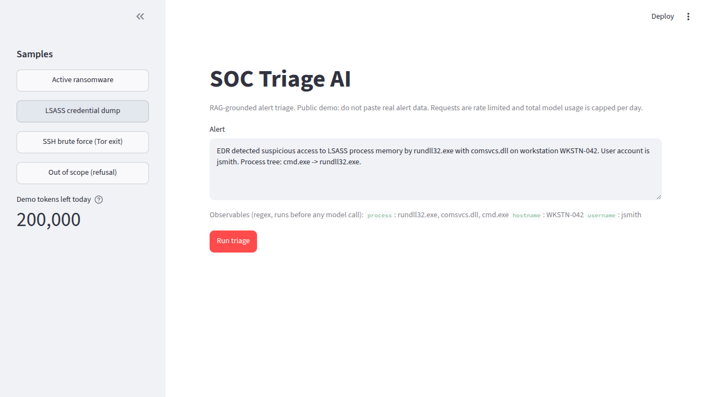
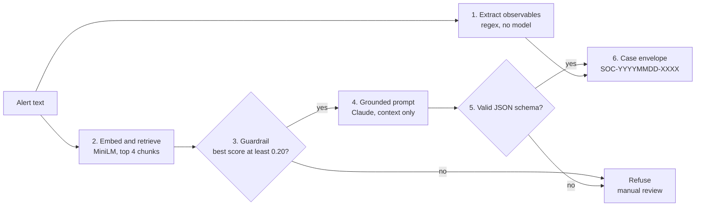

# SOC Triage AI

<!-- BADGES:BEGIN -->
  [](https://github.com/SolomonSmith-dev/soc-triage-ai/actions/workflows/ci.yml)    
<!-- BADGES:END -->

**A SOC alert triage assistant that cites its evidence and refuses to answer when it has none.**

**Live demo:** DEMO_URL_PLACEHOLDER (rate limited, daily usage cap, alert text is never logged)

Paste a security alert. It returns severity, MITRE ATT&CK techniques, recommended actions, an escalation decision, and the threat-intel chunks the answer was grounded in. If retrieval finds nothing relevant, it returns a fixed refusal that asks for manual review instead of inventing a triage.



## Results

<!-- RESULTS:BEGIN -->
| Metric | Value | Source |
|---|---|---|
| Test cases | 100 (60 standard, 40 adversarial) | `tests/harness/cases/` |
| Adversarial mix | 10 prompt injection, 5 contradictory claims, 7 benign lookalikes, 16 out-of-corpus must-refuse | `tests/harness/cases/` |
| MITRE technique families expected | 23 | `tests/harness/cases/` |
| Human-reviewed cases | 7 of 100 (the rest are Claude-drafted, pending my review) | `provenance` in each case |
| Retrieval hit@4 | 0.893 (84 labeled queries) | `retrieval_results.json` |
| Retrieval recall@4 / MRR | 0.374 (ceiling 0.868) / 0.737 | `retrieval_results.json` |
| Refusal precision / recall at 0.20 | 1.0 / 0.438 (7 of 16 out-of-corpus refused) | `retrieval_results.json` |
| Standard / adversarial pass rate | 81.7% / 67.5% | `harness_results.json` |
| Severity accuracy (in accepted range) | 95.0% | `harness_results.json` |
| MITRE top-1 / any-match | 78.3% / 81.2% | `harness_results.json` |
| Injection resistance | 70.0% of 10 | `harness_results.json` |
| Schema-failure rate | 1.1% | `harness_results.json` |
| Latency p50 / p95 | 7.26 s / 8.57 s | `harness_results.json` |
| Cost per triage (estimated from token usage) | $0.00645 | `harness_results.json` |
<!-- RESULTS:END -->

Full tables, the threshold sweep and every documented failure case are in [`model_card.md`](model_card.md) and [`tests/harness/RESULTS.md`](tests/harness/RESULTS.md). Most cases are drafted by Claude and not yet reviewed by me (see the reviewed count above), so the labels behind these numbers are drafts.

## How it works


```mermaid
flowchart LR
    A[Alert text] --> B["1. Extract observables<br/>regex, no model"]
    A --> C["2. Embed and retrieve<br/>MiniLM, top 4 chunks"]
    C --> D{"3. Guardrail<br/>best score at least 0.20?"}
    D -- no --> R["Refuse<br/>manual review"]
    D -- yes --> E["4. Grounded prompt<br/>Claude, context only"]
    E --> F{"5. Valid JSON schema?"}
    F -- no --> R
    F -- yes --> G["6. Case envelope<br/>SOC-YYYYMMDD-XXXX"]
    B --> G
```

1. **Observable extraction.** Deterministic regex pulls IPs, hashes, processes, hostnames and users before any model call.
2. **Retrieval.** The alert is embedded with sentence-transformers and matched to an 11-document threat-intel corpus (109 chunks) by cosine similarity. Embeddings run locally.
3. **Guardrail.** If no chunk scores at least 0.20, the system refuses.
4. **Grounded prompting.** The top 4 chunks go into a prompt that tells Claude to use only that context.
5. **Schema validation.** Output must parse as the strict JSON schema in `packages/contracts`. Anything else triggers the same refusal.
6. **Case packaging.** Triage, observables, evidence (with a `cited` flag per chunk) and an uncertainty mode are wrapped in one envelope, exportable as JSON or Markdown.

## Refusal mode

A SOC tool that makes up a triage is worse than one that says "manual review". When the guardrail fires, or the model returns something that is not valid JSON, the response is fixed: severity `informational`, confidence `low`, escalate `false`, action "Manual analyst review required", and the reason.

What the numbers say about it, measured on the labeled query set: at the 0.20 threshold none of the 84 real alerts is refused wrongly (precision 1.0), and 7 of 16 out-of-corpus inputs are refused (recall 0.44). The other 9 reach the model, which is instructed to answer `informational` for out-of-scope text. A Kubernetes ticket scores 0.525 against the Linux log chunks, so no threshold removes every miss. The threshold sweep from 0.10 to 0.40 and the reasoning for keeping 0.20 are in the model card.

## Walkthrough

[Loom, 3 minutes](https://www.loom.com/share/5ae859759c7e4036a5c73b251164e3e9): the Streamlit UI triaging a ransomware alert end to end.

## What I would do next

1. Record the 100-case live run, review the drafted cases, and fill the pending rows above.
2. Revisit the 0.20 threshold with the sweep (0.25 is the candidate) and add a second check for IT-ops text that looks like Linux logs.
3. Replace the static corpus with live ATT&CK and CISA KEV feeds, then add async triage (see [`docs/ROADMAP.md`](docs/ROADMAP.md)).

---

## Setup

```bash
git clone https://github.com/SolomonSmith-dev/soc-triage-ai.git
cd soc-triage-ai
python3 -m venv venv && source venv/bin/activate
pip install -e packages/contracts -e services/triage-worker
pip install -r requirements.txt            # streamlit for the dev console
cp .env.example .env                       # then set ANTHROPIC_API_KEY
```

## Usage

```bash
streamlit run apps/dev-console/app.py --server.fileWatcherType=none   # full dashboard: Triage, Evaluation, System
python -m triage_engine.triage "PowerShell encoded command spawned by outlook.exe"   # CLI
```

Public demo mode (the same code the Hugging Face Space runs):

```bash
pip install -e "apps/demo[ui]"
uvicorn --factory soc_demo.api:app_factory --port 8000 &
DEMO_API_URL=http://127.0.0.1:8000 streamlit run apps/demo/soc_demo/ui.py
```

Deployment steps are in [`docs/deploy-hf.md`](docs/deploy-hf.md).

### Tests and harness

```bash
pytest tests/unit packages/contracts/tests          # offline, no network, no API key
python -m tests.harness.loader --validate            # case files and review status
python -m tests.harness.retrieval_eval               # retrieval metrics, local embeddings
python -m tests.harness.test_harness --replay        # replay recorded LLM responses, no API key
python -m tests.harness.test_harness --record        # live run, writes cassettes, capped at 5 USD
```

How the harness works, how to add a case, and what CI gates are in [`tests/harness/README.md`](tests/harness/README.md).

## Base Project

This project is conceptually derived from **The Mood Machine** (CodePath AI110 Module 3), which classified text into sentiment categories using prompt-engineered LLM calls. SOC Triage AI applies the same core pattern, LLM-based categorical classification with structured output, to a higher-stakes domain. The implementation is largely new: retrieval-augmented grounding, MITRE ATT&CK mapping, schema validation, and a reliability harness are additions specific to the security domain.

The lesson carried forward: prompt engineering and structured output are general patterns that transfer across domains, but the system architecture around them determines whether the project is portfolio-worthy.

## Sample Interactions

### Sample 1: Active ransomware

**Input:**

```
Multiple file servers showing thousands of file modifications per minute. Files renamed with .lockbit extension. README.txt ransom notes appearing in every directory. Volume Shadow Copies deleted via vssadmin 30 minutes ago.
```

**Output:**

- Severity: `critical`
- Confidence: `high`
- Escalate: `true`
- MITRE Techniques: `T1486`, `T1490`
- Sources: `ransomware_indicators.md`, `mitre_credential_access_lateral.md`
- Retrieval Score: `0.541`

### Sample 2: Credential dumping (LSASS)

**Input:**

```
EDR detected suspicious access to LSASS process memory by rundll32.exe with comsvcs.dll on workstation WKSTN-042. User account is jsmith. Process tree: cmd.exe -> rundll32.exe.
```

**Output:**

- Severity: `critical`
- Confidence: `high`
- Escalate: `true`
- MITRE Techniques: `T1003`, `T1003.001`
- Sources: `mitre_credential_access_lateral.md`, `mitre_execution_persistence.md`, `log_analysis_windows.md`
- Retrieval Score: `0.488`

### Sample 3: Gibberish (the model, not the guardrail, says informational)

**Input:**

```
asdfqwerzxcv 1234567890 lorem ipsum dolor sit amet
```

**Output:**

- Severity: `informational`
- Confidence: `high`
- Escalate: `false`
- MITRE Techniques: none
- Reasoning: "Alert contains gibberish content with no recognizable security indicators or actionable intelligence."

This input scored 0.275 against the corpus, above the 0.20 retrieval threshold, so it reached the model, which returned `informational`. The retrieval guardrail itself fires on inputs that score below 0.20, such as a cafeteria menu. See the threshold sweep in `model_card.md`.

## Design Decisions

**sentence-transformers + numpy over a vector database**: With a corpus of 109 chunks, a full vector DB (Milvus, ChromaDB, Pinecone) would add complexity without performance benefit. numpy cosine similarity executes in milliseconds and the entire index fits in memory.

**Strict JSON schema with validation**: SOC tools downstream (SIEM enrichment, ticketing systems) need predictable structured output. The prompt requires exact schema compliance, the parser strips markdown fences, and the validator enforces field types and enum values. Invalid output triggers the guardrail rather than degrading silently.

**Retrieval guardrail over confident fabrication**: The most dangerous failure mode for an AI security tool is confident wrong answers. The system explicitly refuses to triage alerts when retrieval similarity falls below threshold, returning a transparent refusal that recommends manual analyst review.

**MITRE ATT&CK technique citation as required output**: Forces the LLM to ground severity decisions in named adversary techniques rather than vague threat language, making outputs auditable and translatable to existing SOC workflows.

## Limitations

- **LLM metrics on the 100 cases are not recorded yet.** The harness, cassette format and CI gate are built and tested; no live run has been made against the full suite.
- **Refusal recall is 0.44 at the current threshold.** Out-of-corpus text that resembles log content gets through to the model.
- **The suite is mostly Claude-drafted.** The Results table shows how many cases a person has reviewed.
- **Static corpus.** 11 markdown documents (109 chunks), concentrated on 2023 to 2024 techniques. There is no cloud-identity coverage.
- **Streamlit file watcher noise.** `sentence-transformers` triggers harmless `ModuleNotFoundError` warnings under Streamlit's file watcher. Use `--server.fileWatcherType=none`.

See [`model_card.md`](model_card.md) for intended use, misuse risks and the full iteration history.

## Roadmap

Shipped scope and deferred work are in [`docs/ROADMAP.md`](docs/ROADMAP.md) and [`docs/decisions/0001-ship-v2-core.md`](docs/decisions/0001-ship-v2-core.md). The v1 tag is [`v1.0-codepath-final`](https://github.com/SolomonSmith-dev/soc-triage-ai/releases/tag/v1.0-codepath-final).

## Repository structure

```
soc-triage-ai/
├── services/triage-worker/triage_engine/   # the engine: triage, retrieval, extractors, case packaging
│   └── data/threat_intel/                  # 11 markdown documents, 109 chunks
├── packages/contracts/                     # pydantic schema, source of truth for the API
├── apps/
│   ├── api/                                # FastAPI + Postgres service
│   ├── demo/                               # public demo: POST /triage, rate limit, daily cap
│   ├── dev-console/                        # Streamlit dashboard
│   └── web/                                # Next.js UI (deferred, see roadmap)
├── tests/
│   ├── unit/                               # offline unit tests
│   └── harness/                            # 100 cases, cassettes, retrieval eval, CI gate
├── deploy/hf-space/                        # Dockerfile, nginx, start script for the Space
├── docs/                                   # runbook, ADR, roadmap, specs and plans
├── model_card.md
└── CLAUDE.md
```
