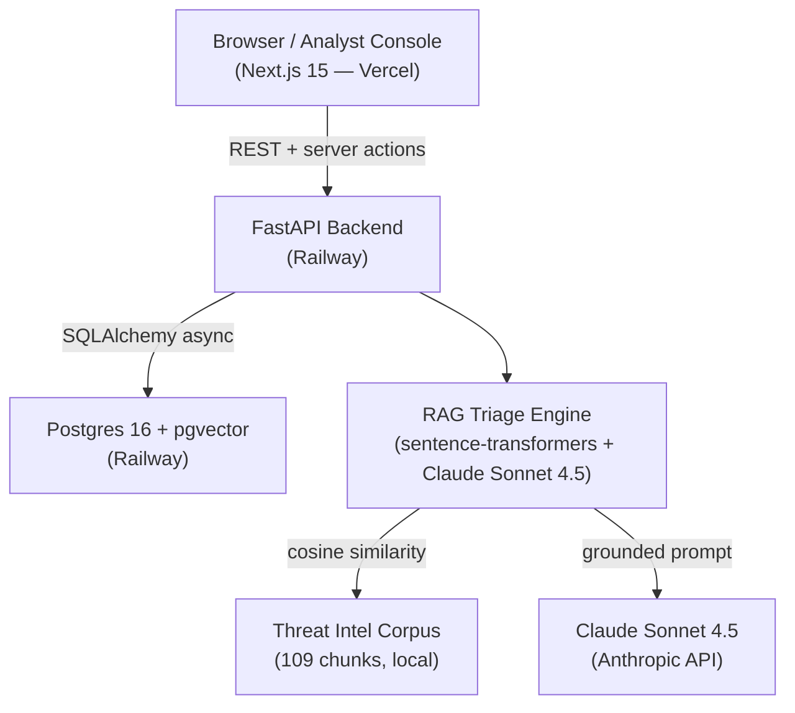

# SOC Triage Copilot: Professional Project Implementation Plan

> **For agentic workers:** REQUIRED SUB-SKILL: Use superpowers:subagent-driven-development (recommended) or superpowers:executing-plans to implement this plan task-by-task. Steps use checkbox (`- [ ]`) syntax for tracking.

**Goal:** Ship a portfolio-grade SOC Triage Copilot with a polished GitHub repo and a live demo (submit alert → triage → analyst override → audit trail).

**Architecture:** Four bug fixes unblock the demo, five Phase 2 tasks complete the analyst loop, two deploy tasks put it live on Railway + Vercel, one seed task pre-populates demo data, and a polish pass writes the README and model card.

**Tech Stack:** Python 3.12, FastAPI, SQLAlchemy async, Alembic, argon2-cffi, PyJWT — Next.js 15, React 19, next-auth v4, Tailwind — Postgres 16 + pgvector, sentence-transformers, Claude Sonnet 4.5 — Railway (API + DB), Vercel (web).

**Spec:** `docs/superpowers/specs/2026-05-21-professional-project-design.md`

---

## File Map

### Created by this plan

| File | Purpose |
|------|---------|
| `apps/web/src/app/submit/actions.ts` | Server action: proxy POST /alerts + POST /triage/jobs with server-side API key |
| `apps/api/src/soc_api/routers/auth.py` | POST /auth/login endpoint |
| `apps/api/tests/test_auth_login.py` | Tests for POST /auth/login |
| `apps/web/src/app/api/auth/[...nextauth]/route.ts` | NextAuth handler with CredentialsProvider |
| `apps/web/src/app/login/page.tsx` | Login form page |
| `apps/web/src/middleware.ts` | Protect /dashboard and /cases routes |
| `apps/api/src/soc_api/services/override_service.py` | get_materialized_case + create_override |
| `apps/api/tests/test_override_service.py` | Tests for override service |
| `apps/api/src/soc_api/routers/overrides.py` | POST /cases/{id}/overrides |
| `apps/api/tests/test_overrides_router.py` | Tests for override router |
| `apps/web/src/components/EditPanel.tsx` | Severity/escalate override form |
| `apps/web/src/components/HistoryPanel.tsx` | Audit trail timeline |
| `apps/web/src/app/cases/[id]/actions.ts` | Server action: submit override with session cookie |
| `apps/api/src/soc_api/cli/seed_demo.py` | One-time demo data seeder |
| `railway.toml` | Railway deploy config |

### Modified by this plan

| File | Change |
|------|--------|
| `apps/web/src/app/submit/SubmitForm.tsx` | Call `ingestAndTriage` server action instead of `api.*` directly |
| `apps/api/src/soc_api/deps.py` | Accept both NextAuth cookie names |
| `apps/web/package.json` | Add next-auth; add predev/prebuild scripts |
| `apps/web/tsconfig.json` | Add `"baseUrl": "."` |
| `apps/web/src/lib/contracts.ts` | Re-generated after contract changes |
| `apps/api/src/soc_api/main.py` | Register auth + overrides routers |
| `apps/api/src/soc_api/routers/cases.py` | GET /cases/{id} returns materialized view |
| `apps/api/Dockerfile` | Add packages/contracts install; remove --reload |
| `apps/web/src/app/cases/[id]/page.tsx` | Add EditPanel + HistoryPanel |
| `model_card.md` | Update harness numbers + document override loop |
| `README.md` | Full rewrite with demo link, badges, diagram |
| `docs/architecture.mermaid` | Update to v2 stack |

---

## Group 1: Bug Fixes

---

### Task 1: Server action for alert ingest (Bug Fix 1)

**Files:**
- Create: `apps/web/src/app/submit/actions.ts`
- Modify: `apps/web/src/app/submit/SubmitForm.tsx`

- [ ] **Step 1: Create the server action**

`apps/web/src/app/submit/actions.ts`:
```typescript
"use server";

export async function ingestAndTriage(
  rawText: string,
): Promise<{ caseId: string }> {
  const apiUrl = process.env.API_URL ?? "http://localhost:8000";
  const apiKey = process.env.INGEST_API_KEY;
  if (!apiKey) throw new Error("INGEST_API_KEY not configured");

  const ingestRes = await fetch(`${apiUrl}/alerts`, {
    method: "POST",
    headers: {
      "Content-Type": "application/json",
      Authorization: `Bearer ${apiKey}`,
    },
    body: JSON.stringify({ raw_text: rawText, source: "manual" }),
    cache: "no-store",
  });
  if (!ingestRes.ok) {
    const body = await ingestRes.text();
    throw new Error(`Ingest ${ingestRes.status}: ${body}`);
  }
  const { alert_id } = await ingestRes.json();

  const triageRes = await fetch(`${apiUrl}/triage/jobs`, {
    method: "POST",
    headers: { "Content-Type": "application/json" },
    body: JSON.stringify({ alert_id }),
    cache: "no-store",
  });
  if (!triageRes.ok) {
    const body = await triageRes.text();
    throw new Error(`Triage ${triageRes.status}: ${body}`);
  }
  const { case_id } = await triageRes.json();
  return { caseId: case_id };
}
```

- [ ] **Step 2: Update SubmitForm to use the server action**

In `apps/web/src/app/submit/SubmitForm.tsx`, replace the `onSubmit` function body:

Old (lines ~36-45):
```typescript
    try {
      const ingest = await api.ingestAlert({ raw_text: text, source: "manual" });
      const job = await api.submitTriage({ alert_id: ingest.alert_id });
      if (job.case_id) {
        router.push(`/cases/${job.case_id}`);
      } else {
        setErr("Triage completed without a case_id. Check API logs.");
        setBusy(false);
      }
    } catch (e) {
```

New:
```typescript
    try {
      const { caseId } = await ingestAndTriage(text);
      router.push(`/cases/${caseId}`);
    } catch (e) {
```

Also add the import at the top of the file:
```typescript
import { ingestAndTriage } from "./actions";
```

Remove the `import { api } from "@/lib/api";` line if it is no longer used elsewhere in the file.

- [ ] **Step 3: Add INGEST_API_KEY to .env.example**

Append to `.env.example`:
```
# Server-side only — never NEXT_PUBLIC_*. Value is the plaintext bearer token
# issued by seed_admin or seed_demo for the "ingest" scope.
INGEST_API_KEY=replace-with-your-demo-ingest-key
```

- [ ] **Step 4: Commit**

```bash
git add apps/web/src/app/submit/actions.ts apps/web/src/app/submit/SubmitForm.tsx .env.example
git commit -m "fix: proxy alert ingest through server action, keep API key server-side"
```

---

### Task 2: Accept both NextAuth cookie names (Bug Fix 2)

**Files:**
- Modify: `apps/api/src/soc_api/deps.py`

- [ ] **Step 1: Update current_user to read both cookie variants**

Replace the `current_user` signature and token extraction in `apps/api/src/soc_api/deps.py`:

```python
async def current_user(
    session_token: str | None = Cookie(default=None, alias="next-auth.session-token"),
    secure_session_token: str | None = Cookie(
        default=None, alias="__Secure-next-auth.session-token"
    ),
    authorization: str | None = Header(default=None),
    session: AsyncSession = Depends(get_session),
) -> User:
    """Cookie-first (NextAuth JWT), Bearer fallback. Raises 401 if neither resolves."""
    if not _JWT_AVAILABLE:
        raise HTTPException(status_code=500, detail="JWT library not installed")

    # Accept either cookie name — HTTP uses next-auth.session-token,
    # HTTPS (Vercel) uses __Secure-next-auth.session-token.
    raw_cookie = session_token or secure_session_token
    user_id: str | None = None

    if raw_cookie:
        try:
            payload = jwt.decode(
                raw_cookie,
                settings.nextauth_secret,
                algorithms=["HS256"],
            )
            user_id = payload.get("sub")
        except jwt.PyJWTError:
            pass

    if not user_id and authorization and authorization.startswith("Bearer "):
        token = authorization.removeprefix("Bearer ")
        try:
            payload = jwt.decode(
                token,
                settings.nextauth_secret,
                algorithms=["HS256"],
            )
            user_id = payload.get("sub")
        except jwt.PyJWTError:
            pass

    if not user_id:
        raise _UNAUTH

    result = await session.execute(select(User).where(User.id == user_id))
    user = result.scalar_one_or_none()
    if not user:
        raise _UNAUTH

    return user
```

- [ ] **Step 2: Commit**

```bash
git add apps/api/src/soc_api/deps.py
git commit -m "fix(auth): accept __Secure-next-auth.session-token for HTTPS deployments"
```

---

### Task 3: Fix contracts.ts generation pipeline (Bug Fix 3)

**Files:**
- Modify: `apps/web/package.json`
- Commit: `apps/web/src/lib/contracts.ts` (generated artifact)

- [ ] **Step 1: Add predev and prebuild scripts to package.json**

In `apps/web/package.json`, update the `scripts` block:

```json
"scripts": {
  "predev": "cd ../.. && python packages/contracts/scripts/export_schemas.py && cd apps/web && node scripts/gen-types.mjs",
  "prebuild": "cd ../.. && python packages/contracts/scripts/export_schemas.py && cd apps/web && node scripts/gen-types.mjs",
  "dev": "next dev --port 3000",
  "build": "next build",
  "start": "next start --port 3000",
  "lint": "next lint",
  "gen:types": "node ./scripts/gen-types.mjs",
  "typecheck": "tsc --noEmit"
}
```

- [ ] **Step 2: Generate contracts.ts and commit it**

From the repo root:
```bash
cd /path/to/soc-triage-ai
python packages/contracts/scripts/export_schemas.py
cd apps/web
node scripts/gen-types.mjs
```

Expected output: `wrote src/lib/contracts.ts (10 schemas)`

- [ ] **Step 3: Remove contracts.ts from .gitignore if present, commit the file**

```bash
# Check if it's gitignored
grep -n "contracts.ts" apps/web/.gitignore 2>/dev/null || echo "not gitignored"
```

If it is listed, remove that line. Then:

```bash
git add apps/web/package.json apps/web/src/lib/contracts.ts
git commit -m "fix: commit generated contracts.ts; add predev/prebuild to keep it fresh"
```

---

### Task 4: Fix tsconfig.json baseUrl (Bug Fix 4)

**Files:**
- Modify: `apps/web/tsconfig.json`

- [ ] **Step 1: Add baseUrl**

In `apps/web/tsconfig.json`, add `"baseUrl": "."` to `compilerOptions`:

```json
{
  "compilerOptions": {
    "target": "ES2022",
    "lib": ["dom", "dom.iterable", "esnext"],
    "allowJs": false,
    "skipLibCheck": true,
    "strict": true,
    "noEmit": true,
    "esModuleInterop": true,
    "module": "esnext",
    "moduleResolution": "bundler",
    "resolveJsonModule": true,
    "isolatedModules": true,
    "jsx": "preserve",
    "incremental": true,
    "plugins": [{ "name": "next" }],
    "baseUrl": ".",
    "paths": { "@/*": ["./src/*"] }
  },
  "include": ["next-env.d.ts", "**/*.ts", "**/*.tsx", ".next/types/**/*.ts"],
  "exclude": ["node_modules"]
}
```

- [ ] **Step 2: Verify typecheck passes**

```bash
cd apps/web && npm run typecheck
```

Expected: no errors (or only pre-existing errors unrelated to path resolution).

- [ ] **Step 3: Commit**

```bash
git add apps/web/tsconfig.json
git commit -m "fix(web): add baseUrl to tsconfig so @/* path aliases resolve correctly"
```

---

## Group 2: Phase 2 Completion

---

### Task 5: POST /auth/login endpoint + tests (Commit 3, API side)

**Files:**
- Create: `apps/api/src/soc_api/routers/auth.py`
- Modify: `apps/api/src/soc_api/main.py`
- Create: `apps/api/tests/test_auth_login.py`

- [ ] **Step 1: Write the failing test**

`apps/api/tests/test_auth_login.py`:
```python
"""Integration tests for POST /auth/login."""
from __future__ import annotations

import pytest
from httpx import AsyncClient
from sqlalchemy.ext.asyncio import AsyncSession

from soc_api.models.orm import User
from soc_api.security import hash_password


@pytest.fixture
async def demo_user(session: AsyncSession) -> dict:
    user = User(
        email="analyst@test.local",
        password_hash=hash_password("CorrectPass123!"),
        role="analyst",
    )
    session.add(user)
    await session.commit()
    return {"email": "analyst@test.local", "password": "CorrectPass123!"}


async def test_login_returns_user_info(client: AsyncClient, demo_user: dict) -> None:
    resp = await client.post("/auth/login", json=demo_user)
    assert resp.status_code == 200
    body = resp.json()
    assert body["email"] == demo_user["email"]
    assert body["role"] == "analyst"
    assert "id" in body


async def test_login_wrong_password(client: AsyncClient, demo_user: dict) -> None:
    resp = await client.post("/auth/login", json={**demo_user, "password": "WrongPass!"})
    assert resp.status_code == 401


async def test_login_unknown_email(client: AsyncClient) -> None:
    resp = await client.post(
        "/auth/login", json={"email": "ghost@test.local", "password": "AnyPass123!"}
    )
    assert resp.status_code == 401
```

- [ ] **Step 2: Run test to confirm it fails**

```bash
cd /path/to/soc-triage-ai
pytest apps/api/tests/test_auth_login.py -v
```

Expected: `ERROR` — `No module named 'soc_api.routers.auth'` or similar import error.

- [ ] **Step 3: Create the auth router**

`apps/api/src/soc_api/routers/auth.py`:
```python
"""POST /auth/login — verify credentials, return user info for NextAuth."""
from __future__ import annotations

from fastapi import APIRouter, Depends, HTTPException, status
from pydantic import BaseModel
from sqlalchemy import select
from sqlalchemy.ext.asyncio import AsyncSession

from soc_api.db import get_session
from soc_api.models.orm import User
from soc_api.security import verify_password

router = APIRouter(prefix="/auth", tags=["auth"])


class LoginRequest(BaseModel):
    email: str
    password: str


class LoginResponse(BaseModel):
    id: str
    email: str
    role: str


_UNAUTH = HTTPException(
    status_code=status.HTTP_401_UNAUTHORIZED,
    detail="Invalid credentials",
)


@router.post("/login", response_model=LoginResponse)
async def login(
    body: LoginRequest,
    session: AsyncSession = Depends(get_session),
) -> LoginResponse:
    result = await session.execute(select(User).where(User.email == body.email))
    user = result.scalar_one_or_none()
    if not user or not verify_password(user.password_hash, body.password):
        raise _UNAUTH
    return LoginResponse(id=str(user.id), email=user.email, role=user.role)
```

- [ ] **Step 4: Register the router in main.py**

In `apps/api/src/soc_api/main.py`, add to the imports:
```python
from soc_api.routers import alerts, auth, cases, corpus, eval, health, retrieval, triage
```

And add `auth.router` to the router registration loop:
```python
for router in (health.router, auth.router, alerts.router, triage.router, cases.router, eval.router, retrieval.router, corpus.router):
    app.include_router(router)
```

- [ ] **Step 5: Run tests to confirm they pass**

```bash
pytest apps/api/tests/test_auth_login.py -v
```

Expected: `3 passed`.

- [ ] **Step 6: Commit**

```bash
git add apps/api/src/soc_api/routers/auth.py apps/api/src/soc_api/main.py apps/api/tests/test_auth_login.py
git commit -m "feat(api): POST /auth/login for NextAuth CredentialsProvider"
```

---

### Task 6: NextAuth credentials provider + login page (Commit 3, web side)

**Files:**
- Modify: `apps/web/package.json` (add next-auth)
- Create: `apps/web/src/app/api/auth/[...nextauth]/route.ts`
- Create: `apps/web/src/app/login/page.tsx`
- Create: `apps/web/src/middleware.ts`

- [ ] **Step 1: Install next-auth**

```bash
cd apps/web && npm install next-auth@4
```

- [ ] **Step 2: Create NextAuth handler**

Create `apps/web/src/app/api/auth/[...nextauth]/route.ts`:
```typescript
import NextAuth, { type NextAuthOptions } from "next-auth";
import CredentialsProvider from "next-auth/providers/credentials";

export const authOptions: NextAuthOptions = {
  providers: [
    CredentialsProvider({
      name: "credentials",
      credentials: {
        email: { label: "Email", type: "email" },
        password: { label: "Password", type: "password" },
      },
      async authorize(credentials) {
        if (!credentials?.email || !credentials?.password) return null;
        const apiUrl = process.env.API_URL ?? "http://localhost:8000";
        const res = await fetch(`${apiUrl}/auth/login`, {
          method: "POST",
          headers: { "Content-Type": "application/json" },
          body: JSON.stringify({
            email: credentials.email,
            password: credentials.password,
          }),
          cache: "no-store",
        });
        if (!res.ok) return null;
        return res.json() as Promise<{ id: string; email: string; role: string }>;
      },
    }),
  ],
  session: { strategy: "jwt" },
  secret: process.env.NEXTAUTH_SECRET,
  pages: { signIn: "/login" },
  callbacks: {
    jwt({ token, user }) {
      if (user) {
        token.id = user.id;
        token.role = (user as { id: string; email: string; role: string }).role;
      }
      return token;
    },
    session({ session, token }) {
      (session.user as { id?: string; role?: string }).id = token.id as string;
      (session.user as { id?: string; role?: string }).role = token.role as string;
      return session;
    },
  },
};

const handler = NextAuth(authOptions);
export { handler as GET, handler as POST };
```

- [ ] **Step 3: Create login page**

`apps/web/src/app/login/page.tsx`:
```typescript
"use client";

import { signIn } from "next-auth/react";
import { useRouter } from "next/navigation";
import { useState } from "react";

export default function LoginPage() {
  const router = useRouter();
  const [error, setError] = useState<string | null>(null);
  const [busy, setBusy] = useState(false);

  async function onSubmit(e: React.FormEvent<HTMLFormElement>) {
    e.preventDefault();
    setBusy(true);
    setError(null);
    const fd = new FormData(e.currentTarget);
    const result = await signIn("credentials", {
      email: fd.get("email"),
      password: fd.get("password"),
      redirect: false,
    });
    if (result?.error) {
      setError("Invalid email or password.");
      setBusy(false);
    } else {
      router.push("/dashboard");
    }
  }

  return (
    <main className="flex min-h-screen items-center justify-center p-4">
      <div className="card w-full max-w-sm p-6 space-y-4">
        <h1 className="text-lg font-semibold text-ink">SOC Triage Copilot</h1>
        <p className="text-sm text-ink-mute">
          Demo credentials:{" "}
          <span className="font-mono">demo@soctriage.ai</span> /{" "}
          <span className="font-mono">Demo1234!</span>
        </p>
        <form onSubmit={onSubmit} className="space-y-3">
          <input
            name="email"
            type="email"
            placeholder="Email"
            required
            className="mock-input w-full"
          />
          <input
            name="password"
            type="password"
            placeholder="Password"
            required
            className="mock-input w-full"
          />
          {error && <p className="text-red-400 text-sm">{error}</p>}
          <button
            type="submit"
            disabled={busy}
            className="mock-button w-full"
          >
            {busy ? "Signing in…" : "Sign in"}
          </button>
        </form>
      </div>
    </main>
  );
}
```

- [ ] **Step 4: Create middleware to protect routes**

`apps/web/src/middleware.ts`:
```typescript
export { default } from "next-auth/middleware";

export const config = {
  matcher: ["/dashboard/:path*", "/cases/:path*"],
};
```

- [ ] **Step 5: Verify the web app builds**

```bash
cd apps/web && npm run build
```

Expected: build completes without TypeScript errors.

- [ ] **Step 6: Commit**

```bash
git add apps/web/src/app/api/auth apps/web/src/app/login apps/web/src/middleware.ts apps/web/package.json apps/web/package-lock.json
git commit -m "feat(web): NextAuth credentials provider + login page + route protection"
```

---

### Task 7: Override service + tests (Commit 4)

**Files:**
- Create: `apps/api/src/soc_api/services/override_service.py`
- Create: `apps/api/tests/test_override_service.py`

- [ ] **Step 1: Write the failing tests**

`apps/api/tests/test_override_service.py`:
```python
"""Unit tests for override_service."""
from __future__ import annotations

import uuid
from datetime import datetime, timezone

import pytest
from sqlalchemy.ext.asyncio import AsyncSession

from soc_api.models.orm import AnalystOverride, ApiKey, Case, User
from soc_api.security import generate_api_key, hash_password
from soc_api.services import override_service
from soc_api.services.bootstrap import DEFAULT_TENANT_ID, BOOTSTRAP_CORPUS_LABEL
from soc_api.models.orm import CorpusVersion

_ENVELOPE = {
    "case_id": "SOC-20260101-abcd",
    "timestamp": "2026-01-01T00:00:00+00:00",
    "alert_raw": "Test alert",
    "observables": {
        "ipv4": [], "email": [], "url": [], "domain": [],
        "md5": [], "sha1": [], "sha256": [], "registry_path": [],
        "process": [], "filename": [], "hostname": [], "username": [],
    },
    "triage": {
        "severity": "high",
        "confidence": "high",
        "mitre_techniques": ["T1059"],
        "summary": "Test summary",
        "recommended_actions": ["action1"],
        "escalate": False,
        "reasoning": "Test reasoning",
    },
    "evidence": {
        "chunks_retrieved": [],
        "avg_retrieval_score": 0.0,
        "sources_cited": [],
    },
    "uncertainty_mode": "actionable",
    "guardrail_triggered": False,
    "analyst_overrides": [],
    "version": {
        "model": "claude-sonnet-4-5",
        "embeddings": "all-MiniLM-L6-v2",
        "corpus_chunks": 109,
        "prompt_version": "v1",
        "top_k": 4,
        "min_similarity": 0.3,
    },
}


@pytest.fixture
async def seeded_case(session: AsyncSession) -> str:
    cv = CorpusVersion(
        label=BOOTSTRAP_CORPUS_LABEL,
        embedding_model="all-MiniLM-L6-v2",
        chunk_count=109,
        is_active=True,
        manifest={},
    )
    session.add(cv)
    await session.flush()

    case = Case(
        id="SOC-20260101-abcd",
        alert_id=uuid.uuid4(),
        envelope=_ENVELOPE,
        uncertainty_mode="actionable",
        severity="high",
        escalate=False,
        guardrail_triggered=False,
        corpus_version_id=cv.id,
        tenant_id=DEFAULT_TENANT_ID,
    )
    session.add(case)
    await session.commit()
    return "SOC-20260101-abcd"


@pytest.fixture
async def analyst_id(session: AsyncSession) -> uuid.UUID:
    user = User(
        email="analyst@test.local",
        password_hash=hash_password("Pass1234567!"),
        role="analyst",
    )
    session.add(user)
    await session.commit()
    await session.refresh(user)
    return user.id


async def test_get_materialized_case_no_overrides(
    session: AsyncSession, seeded_case: str
) -> None:
    result = await override_service.get_materialized_case(seeded_case, session)
    assert result is not None
    assert result.triage.severity.value == "high"
    assert result.analyst_overrides == []


async def test_get_materialized_case_not_found(session: AsyncSession) -> None:
    result = await override_service.get_materialized_case("SOC-99999999-0000", session)
    assert result is None


async def test_create_override_changes_severity(
    session: AsyncSession, seeded_case: str, analyst_id: uuid.UUID
) -> None:
    result = await override_service.create_override(
        case_id=seeded_case,
        analyst_id=analyst_id,
        field="severity",
        new_value="critical",
        rationale="Re-evaluated; ransomware confirmed",
        session=session,
    )
    assert result is not None
    assert result.triage.severity.value == "critical"
    assert len(result.analyst_overrides) == 1
    assert result.analyst_overrides[0].field == "severity"
    assert result.analyst_overrides[0].original == "high"
    assert result.analyst_overrides[0].override == "critical"


async def test_create_override_latest_wins(
    session: AsyncSession, seeded_case: str, analyst_id: uuid.UUID
) -> None:
    await override_service.create_override(
        case_id=seeded_case,
        analyst_id=analyst_id,
        field="severity",
        new_value="critical",
        rationale="First override",
        session=session,
    )
    result = await override_service.create_override(
        case_id=seeded_case,
        analyst_id=analyst_id,
        field="severity",
        new_value="medium",
        rationale="Second override — re-assessed",
        session=session,
    )
    assert result is not None
    assert result.triage.severity.value == "medium"
    assert len(result.analyst_overrides) == 2
```

- [ ] **Step 2: Run to confirm they fail**

```bash
pytest apps/api/tests/test_override_service.py -v
```

Expected: `ERROR` — `No module named 'soc_api.services.override_service'`

- [ ] **Step 3: Implement the override service**

`apps/api/src/soc_api/services/override_service.py`:
```python
"""Override service: materialized case view + analyst override persistence."""
from __future__ import annotations

import uuid
from typing import Any

from sqlalchemy import select
from sqlalchemy.ext.asyncio import AsyncSession

from soc_api.models.orm import AnalystOverride, AuditLog, Case
from soc_contracts import CaseEnvelope

# Fields that are applied to the triage object in the materialized view.
# "notes" is stored in the override record but not applied to triage fields.
_MUTABLE_TRIAGE_FIELDS = {"severity", "escalate", "mitre_techniques"}


async def get_materialized_case(
    case_id: str, session: AsyncSession
) -> CaseEnvelope | None:
    """Load case + overrides, return a merged CaseEnvelope with latest-wins per field."""
    case = await session.get(Case, case_id)
    if case is None:
        return None

    result = await session.execute(
        select(AnalystOverride)
        .where(AnalystOverride.case_id == case_id)
        .order_by(AnalystOverride.created_at.asc())
    )
    overrides = result.scalars().all()

    envelope_dict: dict[str, Any] = dict(case.envelope)
    triage = dict(envelope_dict.get("triage", {}))

    for override in overrides:
        if override.field in _MUTABLE_TRIAGE_FIELDS:
            triage[override.field] = override.new_value

    envelope_dict["triage"] = triage
    envelope_dict["analyst_overrides"] = [
        {
            "field": o.field,
            "original": o.old_value,
            "override": o.new_value,
            "rationale": o.rationale or "",
            "timestamp": o.created_at.isoformat(),
        }
        for o in overrides
    ]

    return CaseEnvelope.model_validate(envelope_dict)


async def create_override(
    case_id: str,
    analyst_id: uuid.UUID,
    field: str,
    new_value: Any,
    rationale: str,
    session: AsyncSession,
) -> CaseEnvelope | None:
    """Append an override record and audit log entry; return updated materialized view."""
    materialized = await get_materialized_case(case_id, session)
    if materialized is None:
        return None

    triage_dict = materialized.triage.model_dump()
    old_value = triage_dict.get(field)
    # For enum fields, model_dump returns the enum value string
    if hasattr(old_value, "value"):
        old_value = old_value.value

    override = AnalystOverride(
        case_id=case_id,
        analyst_id=analyst_id,
        field=field,
        old_value=old_value,
        new_value=new_value,
        rationale=rationale,
    )
    session.add(override)

    audit = AuditLog(
        actor_id=analyst_id,
        actor_type="analyst",
        action="override",
        resource=f"case:{case_id}",
        payload={
            "field": field,
            "old": old_value,
            "new": new_value,
            "rationale": rationale,
        },
    )
    session.add(audit)
    await session.commit()

    return await get_materialized_case(case_id, session)
```

- [ ] **Step 4: Run tests to confirm they pass**

```bash
pytest apps/api/tests/test_override_service.py -v
```

Expected: `5 passed`.

- [ ] **Step 5: Commit**

```bash
git add apps/api/src/soc_api/services/override_service.py apps/api/tests/test_override_service.py
git commit -m "feat(api): override service with materialized case view (latest-wins)"
```

---

### Task 8: Override router + update GET /cases/{id} (Commit 5)

**Files:**
- Create: `apps/api/src/soc_api/routers/overrides.py`
- Create: `apps/api/tests/test_overrides_router.py`
- Modify: `apps/api/src/soc_api/routers/cases.py`
- Modify: `apps/api/src/soc_api/main.py`

- [ ] **Step 1: Write the failing router test**

`apps/api/tests/test_overrides_router.py`:
```python
"""Integration tests for POST /cases/{id}/overrides."""
from __future__ import annotations

import uuid
import pytest
from httpx import AsyncClient
from sqlalchemy.ext.asyncio import AsyncSession

from soc_api.models.orm import ApiKey, Case, CorpusVersion, User
from soc_api.security import generate_api_key, hash_password
from soc_api.services.bootstrap import DEFAULT_TENANT_ID, BOOTSTRAP_CORPUS_LABEL

_ENVELOPE = {
    "case_id": "SOC-20260101-abcd",
    "timestamp": "2026-01-01T00:00:00+00:00",
    "alert_raw": "Test alert",
    "observables": {
        "ipv4": [], "email": [], "url": [], "domain": [],
        "md5": [], "sha1": [], "sha256": [], "registry_path": [],
        "process": [], "filename": [], "hostname": [], "username": [],
    },
    "triage": {
        "severity": "high",
        "confidence": "high",
        "mitre_techniques": ["T1059"],
        "summary": "Test summary",
        "recommended_actions": ["action1"],
        "escalate": False,
        "reasoning": "Test reasoning",
    },
    "evidence": {
        "chunks_retrieved": [],
        "avg_retrieval_score": 0.0,
        "sources_cited": [],
    },
    "uncertainty_mode": "actionable",
    "guardrail_triggered": False,
    "analyst_overrides": [],
    "version": {
        "model": "claude-sonnet-4-5",
        "embeddings": "all-MiniLM-L6-v2",
        "corpus_chunks": 109,
        "prompt_version": "v1",
        "top_k": 4,
        "min_similarity": 0.3,
    },
}


@pytest.fixture
async def seeded_case(session: AsyncSession) -> str:
    cv = CorpusVersion(
        label=BOOTSTRAP_CORPUS_LABEL,
        embedding_model="all-MiniLM-L6-v2",
        chunk_count=109,
        is_active=True,
        manifest={},
    )
    session.add(cv)
    await session.flush()
    case = Case(
        id="SOC-20260101-abcd",
        alert_id=uuid.uuid4(),
        envelope=_ENVELOPE,
        uncertainty_mode="actionable",
        severity="high",
        escalate=False,
        guardrail_triggered=False,
        corpus_version_id=cv.id,
        tenant_id=DEFAULT_TENANT_ID,
    )
    session.add(case)
    await session.commit()
    return "SOC-20260101-abcd"


@pytest.fixture
async def analyst_client(session: AsyncSession, client: AsyncClient):
    """Client with a valid NextAuth-style Bearer JWT for current_user."""
    import jwt as pyjwt
    from soc_api.config import settings
    from soc_api.models.orm import User

    user = User(
        email="analyst@test.local",
        password_hash=hash_password("Pass1234567!"),
        role="analyst",
    )
    session.add(user)
    await session.commit()
    await session.refresh(user)

    token = pyjwt.encode(
        {"sub": str(user.id), "email": user.email},
        settings.nextauth_secret,
        algorithm="HS256",
    )
    client.headers["Authorization"] = f"Bearer {token}"
    return client


async def test_override_changes_severity(
    analyst_client: AsyncClient, seeded_case: str
) -> None:
    resp = await analyst_client.post(
        f"/cases/{seeded_case}/overrides",
        json={"field": "severity", "new_value": "critical", "rationale": "Confirmed"},
    )
    assert resp.status_code == 200
    body = resp.json()
    assert body["triage"]["severity"] == "critical"
    assert len(body["analyst_overrides"]) == 1


async def test_override_invalid_field(
    analyst_client: AsyncClient, seeded_case: str
) -> None:
    resp = await analyst_client.post(
        f"/cases/{seeded_case}/overrides",
        json={"field": "summary", "new_value": "hacked", "rationale": "Test"},
    )
    assert resp.status_code == 422


async def test_override_requires_auth(client: AsyncClient, seeded_case: str) -> None:
    resp = await client.post(
        f"/cases/{seeded_case}/overrides",
        json={"field": "severity", "new_value": "low", "rationale": "Test"},
    )
    assert resp.status_code == 401
```

- [ ] **Step 2: Run to confirm they fail**

```bash
pytest apps/api/tests/test_overrides_router.py -v
```

Expected: `ERROR` — module not found.

- [ ] **Step 3: Create the overrides router**

`apps/api/src/soc_api/routers/overrides.py`:
```python
"""POST /cases/{id}/overrides — analyst override endpoint."""
from __future__ import annotations

from fastapi import APIRouter, Depends, HTTPException, status
from sqlalchemy.ext.asyncio import AsyncSession

from soc_api.db import get_session
from soc_api.deps import current_user
from soc_api.models.orm import User
from soc_api.services import override_service
from soc_contracts import CaseEnvelope, OverrideRequest

router = APIRouter(prefix="/cases", tags=["overrides"])


@router.post("/{case_id}/overrides", response_model=CaseEnvelope)
async def create_override(
    case_id: str,
    body: OverrideRequest,
    session: AsyncSession = Depends(get_session),
    analyst: User = Depends(current_user),
) -> CaseEnvelope:
    result = await override_service.create_override(
        case_id=case_id,
        analyst_id=analyst.id,
        field=body.field,
        new_value=body.new_value,
        rationale=body.rationale,
        session=session,
    )
    if result is None:
        raise HTTPException(
            status_code=status.HTTP_404_NOT_FOUND,
            detail=f"case {case_id} not found",
        )
    return result
```

- [ ] **Step 4: Update GET /cases/{id} to use materialized view**

In `apps/api/src/soc_api/routers/cases.py`, add the import and update `get_case_detail`:

```python
from soc_api.services import case_service, override_service
```

Replace the `get_case_detail` function:
```python
@router.get("/{case_id}", response_model=CaseEnvelope)
async def get_case_detail(
    case_id: str,
    session: AsyncSession = Depends(get_session),
) -> CaseEnvelope:
    result = await override_service.get_materialized_case(case_id, session)
    if result is None:
        raise HTTPException(
            status_code=status.HTTP_404_NOT_FOUND,
            detail=f"case {case_id} not found",
        )
    return result
```

- [ ] **Step 5: Register the overrides router in main.py**

In `apps/api/src/soc_api/main.py`, update the imports:
```python
from soc_api.routers import alerts, auth, cases, corpus, eval, health, overrides, retrieval, triage
```

Add `overrides.router` to the registration loop:
```python
for router in (health.router, auth.router, alerts.router, triage.router, cases.router, overrides.router, eval.router, retrieval.router, corpus.router):
    app.include_router(router)
```

- [ ] **Step 6: Run all API tests**

```bash
pytest apps/api/tests -v
```

Expected: all tests pass (including the 3 new override router tests).

- [ ] **Step 7: Commit**

```bash
git add apps/api/src/soc_api/routers/overrides.py apps/api/src/soc_api/routers/cases.py apps/api/src/soc_api/main.py apps/api/tests/test_overrides_router.py
git commit -m "feat(api): POST /cases/{id}/overrides; GET /cases/{id} returns materialized view"
```

---

### Task 9: EditPanel + HistoryPanel + case detail integration (Commit 6)

**Files:**
- Create: `apps/web/src/app/cases/[id]/actions.ts`
- Create: `apps/web/src/components/EditPanel.tsx`
- Create: `apps/web/src/components/HistoryPanel.tsx`
- Modify: `apps/web/src/app/cases/[id]/page.tsx`

- [ ] **Step 1: Create the override server action**

`apps/web/src/app/cases/[id]/actions.ts`:
```typescript
"use server";

import { cookies } from "next/headers";
import { revalidatePath } from "next/cache";

export async function submitOverride(
  caseId: string,
  field: string,
  newValue: unknown,
  rationale: string,
): Promise<void> {
  const apiUrl = process.env.API_URL ?? "http://localhost:8000";
  const cookieStore = await cookies();
  const token =
    cookieStore.get("next-auth.session-token")?.value ??
    cookieStore.get("__Secure-next-auth.session-token")?.value;

  const res = await fetch(`${apiUrl}/cases/${caseId}/overrides`, {
    method: "POST",
    headers: {
      "Content-Type": "application/json",
      ...(token ? { Authorization: `Bearer ${token}` } : {}),
    },
    body: JSON.stringify({ field, new_value: newValue, rationale }),
    cache: "no-store",
  });

  if (!res.ok) {
    const body = await res.text();
    throw new Error(`Override failed ${res.status}: ${body}`);
  }

  revalidatePath(`/cases/${caseId}`);
}
```

- [ ] **Step 2: Create EditPanel**

`apps/web/src/components/EditPanel.tsx`:
```typescript
"use client";

import { useState, useTransition } from "react";
import { submitOverride } from "@/app/cases/[id]/actions";

const SEVERITY_OPTIONS = ["critical", "high", "medium", "low", "informational"] as const;

interface EditPanelProps {
  caseId: string;
  currentSeverity: string;
  currentEscalate: boolean;
}

export function EditPanel({ caseId, currentSeverity, currentEscalate }: EditPanelProps) {
  const [isPending, startTransition] = useTransition();
  const [severity, setSeverity] = useState(currentSeverity);
  const [escalate, setEscalate] = useState(currentEscalate);
  const [rationale, setRationale] = useState("");
  const [error, setError] = useState<string | null>(null);
  const [saved, setSaved] = useState(false);

  function onSubmit(e: React.FormEvent) {
    e.preventDefault();
    if (!rationale.trim()) {
      setError("Rationale is required.");
      return;
    }
    setError(null);
    startTransition(async () => {
      try {
        if (severity !== currentSeverity) {
          await submitOverride(caseId, "severity", severity, rationale);
        }
        if (escalate !== currentEscalate) {
          await submitOverride(caseId, "escalate", escalate, rationale);
        }
        setSaved(true);
        setRationale("");
        setTimeout(() => setSaved(false), 3000);
      } catch (err) {
        setError(err instanceof Error ? err.message : "Override failed.");
      }
    });
  }

  return (
    <form onSubmit={onSubmit} className="card p-4 space-y-3">
      <div className="sec-label">Analyst Override</div>
      <div className="grid grid-cols-2 gap-3">
        <div>
          <label className="text-xs text-ink-mute block mb-1">Severity</label>
          <select
            value={severity}
            onChange={(e) => setSeverity(e.target.value)}
            className="mock-input w-full"
          >
            {SEVERITY_OPTIONS.map((s) => (
              <option key={s} value={s}>{s}</option>
            ))}
          </select>
        </div>
        <div>
          <label className="text-xs text-ink-mute block mb-1">Escalate</label>
          <select
            value={String(escalate)}
            onChange={(e) => setEscalate(e.target.value === "true")}
            className="mock-input w-full"
          >
            <option value="true">Yes — escalate</option>
            <option value="false">No</option>
          </select>
        </div>
      </div>
      <div>
        <label className="text-xs text-ink-mute block mb-1">
          Rationale <span className="text-red-400">*</span>
        </label>
        <textarea
          value={rationale}
          onChange={(e) => setRationale(e.target.value)}
          placeholder="Why are you overriding this decision?"
          rows={3}
          className="mock-input w-full resize-none"
        />
      </div>
      {error && <p className="text-red-400 text-sm">{error}</p>}
      {saved && <p className="text-green-400 text-sm">Override saved.</p>}
      <button
        type="submit"
        disabled={isPending || (severity === currentSeverity && escalate === currentEscalate)}
        className="mock-button"
      >
        {isPending ? "Saving…" : "Save override"}
      </button>
    </form>
  );
}
```

- [ ] **Step 3: Create HistoryPanel**

`apps/web/src/components/HistoryPanel.tsx`:
```typescript
import type { OverrideRecord } from "@/lib/contracts";

interface HistoryPanelProps {
  overrides: OverrideRecord[];
}

export function HistoryPanel({ overrides }: HistoryPanelProps) {
  if (overrides.length === 0) {
    return (
      <div className="card p-4">
        <div className="sec-label mb-2">Override history</div>
        <p className="text-sm text-ink-faint">No overrides yet.</p>
      </div>
    );
  }

  return (
    <div className="card p-4 space-y-3">
      <div className="sec-label">Override history</div>
      <ol className="space-y-3">
        {overrides.map((o, i) => (
          <li key={i} className="border-l-2 border-l-blue-700 pl-3 space-y-1">
            <div className="flex items-center justify-between">
              <span className="font-mono text-xs text-ink">{o.field}</span>
              <span className="text-xs text-ink-mute">
                {new Date(o.timestamp).toLocaleString()}
              </span>
            </div>
            <div className="text-xs text-ink-dim">
              <span className="line-through text-ink-faint">
                {JSON.stringify(o.original)}
              </span>
              {" → "}
              <span className="text-ink">{JSON.stringify(o.override)}</span>
            </div>
            {o.rationale && (
              <p className="text-xs text-ink-mute italic">{o.rationale}</p>
            )}
          </li>
        ))}
      </ol>
    </div>
  );
}
```

- [ ] **Step 4: Add EditPanel and HistoryPanel to case detail page**

In `apps/web/src/app/cases/[id]/page.tsx`, add imports at the top:
```typescript
import { EditPanel } from "@/components/EditPanel";
import { HistoryPanel } from "@/components/HistoryPanel";
import { getServerSession } from "next-auth";
import { authOptions } from "@/app/api/auth/[...nextauth]/route";
```

Add session check after `const { id } = await params;`:
```typescript
const session = await getServerSession(authOptions);
const isAuthenticated = !!session;
```

Add at the bottom of the `<article>`, before the closing tag:
```typescript
      {isAuthenticated && (
        <div className="grid grid-cols-1 md:grid-cols-2 gap-4">
          <EditPanel
            caseId={envelope.case_id}
            currentSeverity={envelope.triage.severity}
            currentEscalate={envelope.triage.escalate}
          />
          <HistoryPanel overrides={envelope.analyst_overrides ?? []} />
        </div>
      )}
```

- [ ] **Step 5: Verify build**

```bash
cd apps/web && npm run build
```

Expected: build succeeds with no TypeScript errors.

- [ ] **Step 6: Commit**

```bash
git add apps/web/src/app/cases apps/web/src/components/EditPanel.tsx apps/web/src/components/HistoryPanel.tsx
git commit -m "feat(web): EditPanel + HistoryPanel for analyst override loop"
```

---

### Task 10: Final verification (Commit 7)

- [ ] **Step 1: Run the full harness**

```bash
cd /path/to/soc-triage-ai
pytest tests/harness -v
```

Expected: 7/7 passing. If any fail, investigate before proceeding.

- [ ] **Step 2: Run all API unit tests**

```bash
pytest apps/api/tests -v
```

Expected: all passing (12 original + new login + override service + override router tests).

- [ ] **Step 3: Update model_card.md**

In `model_card.md`, update the following sections:
- **Pass rate:** replace with the number from Step 1 (e.g., `7/7 (100%)`)
- **Capabilities:** add a line — "Analyst override loop: severity, escalation decision, and MITRE techniques can be overridden with rationale. Full audit trail persisted to `analyst_overrides` and `audit_logs`."
- **Limits:** add — "Override field validation is enforced at the API layer; the web UI exposes severity and escalate only."

- [ ] **Step 4: Commit model card update**

```bash
git add model_card.md tests/harness_results.json
git commit -m "docs(model-card): update harness numbers + document override loop capability"
```

---

## Group 3: Deployment

---

### Task 11: Fix Dockerfile + Railway config

**Files:**
- Modify: `apps/api/Dockerfile`
- Create: `railway.toml`

- [ ] **Step 1: Fix the Dockerfile**

The current Dockerfile is missing `packages/contracts` and uses `--reload` (dev mode). Replace `apps/api/Dockerfile` with:

```dockerfile
FROM python:3.12-slim AS base

ENV PYTHONUNBUFFERED=1 \
    PYTHONDONTWRITEBYTECODE=1 \
    PIP_NO_CACHE_DIR=1 \
    PIP_DISABLE_PIP_VERSION_CHECK=1

WORKDIR /app

# Copy all local packages
COPY packages/contracts /app/packages/contracts
COPY services/triage-worker /app/services/triage-worker
COPY apps/api /app/apps/api

RUN pip install --upgrade pip \
 && pip install -e /app/packages/contracts \
 && pip install -e /app/services/triage-worker \
 && pip install -e /app/apps/api

WORKDIR /app/apps/api

EXPOSE 8000
CMD ["uvicorn", "soc_api.main:app", "--host", "0.0.0.0", "--port", "8000"]
```

- [ ] **Step 2: Create Railway config**

`railway.toml` at repo root:
```toml
[build]
dockerfilePath = "apps/api/Dockerfile"
buildContext = "."

[deploy]
startCommand = "alembic upgrade head && uvicorn soc_api.main:app --host 0.0.0.0 --port 8000"
healthcheckPath = "/health"
healthcheckTimeout = 60
restartPolicyType = "on-failure"
restartPolicyMaxRetries = 3
```

- [ ] **Step 3: Commit**

```bash
git add apps/api/Dockerfile railway.toml
git commit -m "chore(deploy): fix Dockerfile for production + add railway.toml"
```

---

### Task 12: Vercel config + environment variables

**Files:**
- Create: `apps/web/vercel.json` (optional — Vercel auto-detects Next.js)

- [ ] **Step 1: Set up Railway service**

In the Railway dashboard:
1. Create a new project.
2. Add a Postgres service. In the Postgres service shell, run: `CREATE EXTENSION IF NOT EXISTS vector;` (verify the migration does this automatically — if `0001_initial_schema.py` contains `op.execute("CREATE EXTENSION IF NOT EXISTS vector")`, you can skip this).
3. Add a new service from GitHub repo, pointing to `SolomonSmith-dev/soc-triage-ai`.
4. Set root directory to `.` (Railway uses `railway.toml` for build context).
5. Set environment variables:
   ```
   DATABASE_URL=<from Railway Postgres connection string — use asyncpg variant>
   ANTHROPIC_API_KEY=<your key>
   NEXTAUTH_SECRET=<generate with: openssl rand -base64 32>
   ENVIRONMENT=production
   ```
6. Deploy. Check logs for `alembic upgrade head` completing cleanly.
7. Note the Railway service URL (e.g., `https://soc-triage-ai-api.up.railway.app`).

- [ ] **Step 2: Set up Vercel project**

1. In the Vercel dashboard, import `SolomonSmith-dev/soc-triage-ai`.
2. Set root directory to `apps/web`.
3. Set environment variables:
   ```
   API_URL=<Railway service URL from Step 1>
   NEXT_PUBLIC_API_URL=<same Railway URL>
   NEXTAUTH_SECRET=<same value as used in Railway>
   NEXTAUTH_URL=<your Vercel deployment URL, e.g. https://soc-triage-ai.vercel.app>
   INGEST_API_KEY=<plaintext key from seed_demo — see Task 13>
   ```
4. Deploy.

---

### Task 13: Seed demo data

**Files:**
- Create: `apps/api/src/soc_api/cli/seed_demo.py`

- [ ] **Step 1: Write the seed script**

`apps/api/src/soc_api/cli/seed_demo.py`:
```python
"""One-time demo data seed. Run after initial Railway deploy.

Usage:
    python -m soc_api.cli.seed_demo

Idempotent: skips creation if demo user or cases already exist.
"""
from __future__ import annotations

import asyncio
import uuid
import logging

from sqlalchemy import select
from sqlalchemy.ext.asyncio import create_async_engine, async_sessionmaker

from soc_api.config import settings
from soc_api.models.orm import Alert, ApiKey, User
from soc_api.security import generate_api_key, hash_password
from soc_api.services.bootstrap import DEFAULT_TENANT_ID, ensure_default_corpus
from soc_api.services.triage_service import triage_alert

logger = logging.getLogger(__name__)

DEMO_EMAIL = "demo@soctriage.ai"
DEMO_PASSWORD = "Demo1234!"
DEMO_KEY_LABEL = "demo-ingest-key"

SAMPLE_ALERTS = [
    (
        "ransomware",
        "Multiple file servers showing thousands of file modifications per minute. "
        "Files renamed with .lockbit extension. README.txt ransom notes appearing in "
        "every directory. Volume Shadow Copies deleted via vssadmin 30 minutes ago.",
    ),
    (
        "credential-stuffing",
        "Authentication service reporting 4,200 failed login attempts in 10 minutes "
        "from 312 unique IPs. All targeting /api/v1/auth. Success rate 0.3%. "
        "Valid account 'jsmith@corp.com' authenticated from 3 different countries.",
    ),
    (
        "lateral-movement",
        "Anomalous SMB connections from workstation WKSTN-015 to 47 internal hosts "
        "over 10 minutes. Using domain admin credentials. Source host shows "
        "PsExec artifacts in temp directory and unusual service installations.",
    ),
]


async def seed() -> None:
    engine = create_async_engine(settings.database_url, echo=False)
    factory = async_sessionmaker(engine, expire_on_commit=False)

    async with factory() as session:
        # Demo user
        existing = await session.execute(select(User).where(User.email == DEMO_EMAIL))
        user = existing.scalar_one_or_none()
        if user is None:
            user = User(
                email=DEMO_EMAIL,
                password_hash=hash_password(DEMO_PASSWORD),
                role="analyst",
            )
            session.add(user)
            await session.commit()
            await session.refresh(user)
            logger.info("Created demo user: %s", DEMO_EMAIL)
        else:
            logger.info("Demo user already exists, skipping.")

        # Demo API key
        existing_key = await session.execute(
            select(ApiKey).where(ApiKey.label == DEMO_KEY_LABEL)
        )
        if existing_key.scalar_one_or_none() is None:
            key_id = uuid.uuid4()
            plaintext, hashed = generate_api_key()
            session.add(ApiKey(
                id=key_id,
                key_hash=hashed,
                label=DEMO_KEY_LABEL,
                scopes=["ingest"],
            ))
            await session.commit()
            bearer_token = f"{key_id}.{plaintext}"
            print(f"\n{'='*60}")
            print(f"DEMO INGEST KEY (set as INGEST_API_KEY in Vercel):")
            print(f"  {bearer_token}")
            print(f"{'='*60}\n")
        else:
            logger.info("Demo API key already exists, skipping.")

        # Ensure corpus exists
        await ensure_default_corpus(session)

        # Sample alerts
        existing_alerts = await session.execute(
            select(Alert).where(Alert.source.in_([s for s, _ in SAMPLE_ALERTS]))
        )
        seeded_sources = {a.source for a in existing_alerts.scalars().all()}

        for source, raw_text in SAMPLE_ALERTS:
            if source in seeded_sources:
                logger.info("Alert '%s' already seeded, skipping.", source)
                continue
            alert = Alert(
                raw_text=raw_text,
                source=source,
                tenant_id=DEFAULT_TENANT_ID,
            )
            session.add(alert)
            await session.flush()
            try:
                await triage_alert(session, alert.id)
                logger.info("Seeded case for '%s'.", source)
            except Exception as e:
                logger.warning("Triage failed for '%s': %s", source, e)

    await engine.dispose()


if __name__ == "__main__":
    logging.basicConfig(level=logging.INFO)
    asyncio.run(seed())
```

- [ ] **Step 2: Run it against the Railway DATABASE_URL**

From your local machine (Railway DATABASE_URL set in env):
```bash
DATABASE_URL=<railway-postgres-url> ANTHROPIC_API_KEY=<key> python -m soc_api.cli.seed_demo
```

Copy the printed `INGEST_API_KEY` value and set it in Vercel environment variables.

- [ ] **Step 3: Commit**

```bash
git add apps/api/src/soc_api/cli/seed_demo.py
git commit -m "feat(cli): seed_demo — create demo user, API key, and 3 pre-seeded cases"
```

---

## Group 4: Repository Polish

---

### Task 14: Architecture diagram + README rewrite

**Files:**
- Modify: `docs/architecture.mermaid`
- Modify: `README.md`

- [ ] **Step 1: Update architecture diagram**

Replace `docs/architecture.mermaid` with:


- [ ] **Step 2: Rewrite README.md**

Replace the contents of `README.md`:

```markdown
# SOC Triage Copilot  

A RAG-grounded SOC analyst assistant. Paste a raw security alert, get a structured triage report with severity, MITRE ATT&CK mapping, recommended actions, and an escalation decision. Analysts can override any triage decision with a rationale — every change is logged in an append-only audit trail.


## Try the demo

**[Live demo →](https://soc-triage-ai.vercel.app)**

Guest: paste an alert and submit — no login required.

Analyst loop: log in with `demo@soctriage.ai` / `Demo1234!` to override severity, change escalation decisions, and see the audit trail.

## Six-stage pipeline

1. **Observable extraction** — deterministic regex pulls IPs, hashes, domains, processes before any LLM call.
2. **Embedding-based retrieval** — sentence-transformers (`all-MiniLM-L6-v2`) finds the top-4 threat-intel chunks by cosine similarity. Runs locally, no network call.
3. **Guardrail check** — if no chunk meets the similarity threshold, the system refuses and returns `uncertainty_mode: insufficient_evidence` rather than hallucinating.
4. **Grounded prompting** — top-4 chunks injected into the prompt. The model is constrained to the provided context.
5. **Schema validation** — response must parse against a strict Pydantic contract. Invalid output triggers the guardrail.
6. **Case packaging** — wrapped in a `SOC-YYYYMMDD-XXXX` envelope with analyst overrides applied at read time (base envelope is immutable).

## What's here

```
apps/
  api/          FastAPI backend — auth, alerts, triage, cases, overrides
  web/          Next.js analyst console — dashboard, submit, case detail
  dev-console/  Streamlit observability console (local dev)
packages/
  contracts/    Pydantic models exported as JSON Schema — source of truth
services/
  triage-worker/ RAG engine vendored as a library (v1, frozen)
tests/
  unit/         Engine unit tests (extractors, case packaging, evaluation)
  harness/      7-case reliability harness
```

## Local dev

```bash
# 1. Start Postgres + pgvector
docker compose up -d

# 2. Run migrations and seed admin
cd apps/api
alembic upgrade head
python -m soc_api.cli.seed_admin

# 3. Start API
uvicorn soc_api.main:app --reload

# 4. Start web (separate terminal)
cd apps/web
npm install && npm run dev
```

API: `http://localhost:8000` — Web: `http://localhost:3000`

## Model card

See [`model_card.md`](model_card.md) for documented capabilities, limits, and harness results.

## License

MIT
```

- [ ] **Step 3: Replace the demo URL once Vercel deploy is live**

After Vercel deployment completes, replace `https://soc-triage-ai.vercel.app` with the actual URL in README.md.

- [ ] **Step 4: Commit**

```bash
git add docs/architecture.mermaid README.md
git commit -m "docs: rewrite README with demo link, architecture diagram, pipeline breakdown"
```

---

### Task 15: Merge PR

- [ ] **Step 1: Verify all checks green**

```bash
gh pr checks 1 --repo SolomonSmith-dev/soc-triage-ai
```

Expected: all jobs passing.

- [ ] **Step 2: Merge**

```bash
gh pr merge 1 --repo SolomonSmith-dev/soc-triage-ai --squash --subject "feat: v2 platform — analyst loop, auth, override audit trail, live demo"
```

---

## Execution notes

- Tasks 1–4 (bug fixes) are independent and can be done in any order.
- Tasks 5–9 (Phase 2) must be done in order — each task depends on the previous.
- Tasks 11–13 (deploy) must come after Task 9.
- Task 14 (README) can be done any time after Task 13 when the Vercel URL is known.
- Task 15 (merge) is last.
